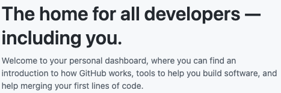

# GitHub Custom Dashboard Intro

An browser extension which allows you to change the intro on your GitHub dashboard. Just a joke, have fun! 😉


Get the extension from [releases](https://github.com/MrWillCom/github-custom-dashboard-intro/releases).

If you want a Safari version of this, you may need to convert it on your own, check out [docs](https://docs.plasmo.com/framework/workflows/faq#what-are-the-officially-supported-browser-targets).

## Why I Made This

Recently, Github added some text to the top of the dashboard:



Then [@aeilot](https://github.com/aeilot), a friend of mine, sent me a joke:


This inspired me to make this extension, allowing users to change the intro, and save the state.

## Building

```sh
pnpm install
pnpm build
```

Or, build for specific target, e.g. `firefox-mv2`:

```sh
pnpm build --target=firefox-mv2
```

## Development

```sh
pnpm dev
```

Then add the extension in `build/chrome-mv3-dev` to your Chrome browser.
